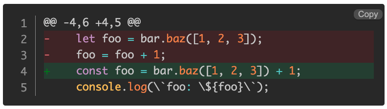
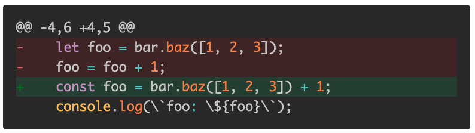
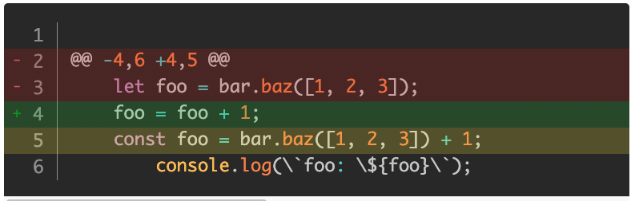
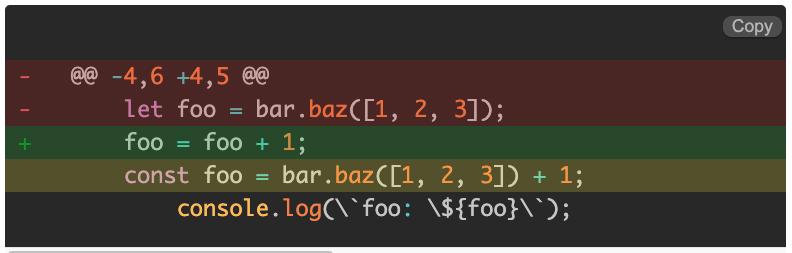
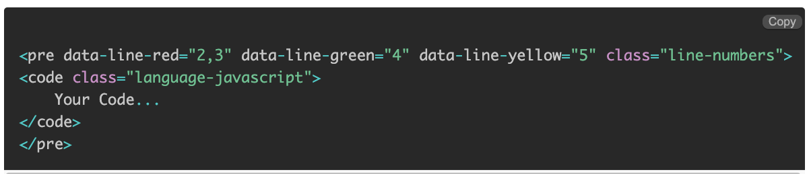

If you find "Diff Highlight" that uses Prism complicated, this is a much easier alternative...

Open the index.html to see it in action

* * *

  
  

Code with "Default Prism Diff Highlight"
----------------------------------------
<pre><code class="language-markup"></code>
&lt;pre class="language-diff-javascript line-numbers" tabindex="0">&lt;code class="diff-highlight language-diff-javascript">&lt;span class="token coord">@@ -4,6 +4,5 @@&lt;/span>
&lt;span class="token deleted-sign deleted language-javascript">&lt;span class="token prefix deleted">-&lt;/span>    &lt;span class="token keyword">let&lt;/span> foo &lt;span class="token operator">=&lt;/span> bar&lt;span class="token punctuation">.&lt;/span>&lt;span class="token function">baz&lt;/span>&lt;span class="token punctuation">(&lt;/span>&lt;span class="token punctuation">[&lt;/span>&lt;span class="token number">1&lt;/span>&lt;span class="token punctuation">,&lt;/span> &lt;span class="token number">2&lt;/span>&lt;span class="token punctuation">,&lt;/span> &lt;span class="token number">3&lt;/span>&lt;span class="token punctuation">]&lt;/span>&lt;span class="token punctuation">)&lt;/span>&lt;span class="token punctuation">;&lt;/span>
&lt;span class="token prefix deleted">-&lt;/span>    foo &lt;span class="token operator">=&lt;/span> foo &lt;span class="token operator">+&lt;/span> &lt;span class="token number">1&lt;/span>&lt;span class="token punctuation">;&lt;/span>
&lt;/span>&lt;span class="token inserted-sign inserted language-javascript">&lt;span class="token prefix inserted">+&lt;/span>    &lt;span class="token keyword">const&lt;/span> foo &lt;span class="token operator">=&lt;/span> bar&lt;span class="token punctuation">.&lt;/span>&lt;span class="token function">baz&lt;/span>&lt;span class="token punctuation">(&lt;/span>&lt;span class="token punctuation">[&lt;/span>&lt;span class="token number">1&lt;/span>&lt;span class="token punctuation">,&lt;/span> &lt;span class="token number">2&lt;/span>&lt;span class="token punctuation">,&lt;/span> &lt;span class="token number">3&lt;/span>&lt;span class="token punctuation">]&lt;/span>&lt;span class="token punctuation">)&lt;/span> &lt;span class="token operator">+&lt;/span> &lt;span class="token number">1&lt;/span>&lt;span class="token punctuation">;&lt;/span>
&lt;/span>&lt;span class="token unchanged language-javascript">&lt;span class="token prefix unchanged"> &lt;/span>    console&lt;span class="token punctuation">.&lt;/span>&lt;span class="token function">log&lt;/span>&lt;span class="token punctuation">(&lt;/span>&lt;span class="token template-string">&lt;span class="token template-punctuation string">\`&lt;/span>&lt;span class="token string">foo: &lt;/span>&lt;span class="token interpolation">&lt;span class="token interpolation-punctuation punctuation">\${&lt;/span>foo&lt;span class="token interpolation-punctuation punctuation">}&lt;/span>&lt;/span>&lt;span class="token template-punctuation string">\`&lt;/span>&lt;/span>&lt;span class="token punctuation">)&lt;/span>&lt;span class="token punctuation">;&lt;/span>&lt;/span>&lt;/code>&lt;/pre>
</code></pre>
  

With line numbers (Add class="line-numbers")

Without line numbers (Remove class="line-numbers")

* * *

  
  

Code with "Diff Highlight Pro"
------------------------------

    
    <pre data-line-red="2,3" data-line-green="4" data-line-yellow="5" class="line-numbers">
    <code class="language-javascript">
        @@ -4,6 +4,5 @@
            let foo = bar.baz([1, 2, 3]);
            foo = foo + 1;
            const foo = bar.baz([1, 2, 3]) + 1;
                console.log(`foo: ${foo}`);
    </code>
    </pre>
    

With line numbers (Add class="line-numbers")

Without line numbers (Remove class="line-numbers")

* * *

  
  

Mode of Use
-----------

  

Add:

&lt;link rel="stylesheet" href="./css/diff-highlight-pro.css"> 
&lt;script src="./js/diff-highlight-pro.js"></script>
  

data-line-red="" for red lines

data-line-green="" for green lines

data-line-yellow="" for yellow lines

  

Single line --> 4

Two lines --> 4,8

Range --> 4-6

Mixed --> 4,6-7

  

<h3>Example</h3>

